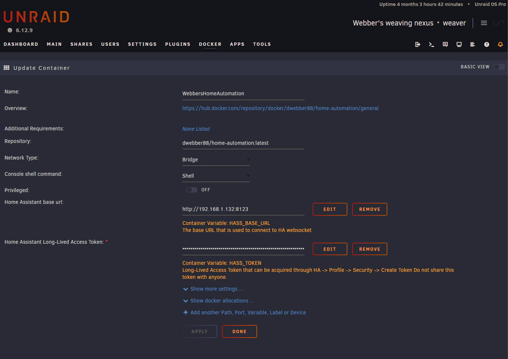
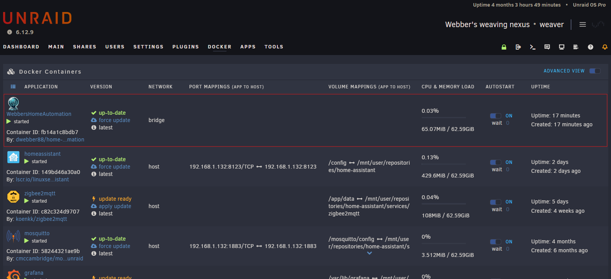

# Webber's Home Automation 🏡💻🐳

Webber's Home Automation consists of TypeScript logic that interacts with a HomeAssistant instance
through a websocket to automate my home. It is a standalone application that runs from a docker
image.

## Rationale

Home Assistant is a great platform for connecting all kinds of smart devices. We'll use it for that purpose.
It's UI-based automations are great for simple tasks. But as the complexity of the automations grows,
it becomes harder to manage them. This project aims to solve that problem by using TypeScript to write
automations.

## Why?

- 🎮 TypeScript gives much more control over automations
- 📄 Simpler to reuse code
- 🧪 Test logic using automated tests
- 🧠 Easier to reason about complexity
- 🧻 Ability to rollback and revise changes
- 👨‍👩‍👧‍👦 Easy to share and collaborate with others
- 🚀 Faster development cycle

## Development

During development, the local application takes precedence over the production container. This
allows me to test new features and automations before deploying them to production.

All development steps are detailed in [DEVELOPMENT.md](./DEVELOPMENT.md).

## Deployment

Personally I run [an Unraid server](https://takken.io/blog/building-an-energy-efficient-server) at
home that runs at 7 watts when there is no load. This is where I deploy home automation related
containers.

### Settings

The settings are simple

It uses the following environment variables

- `HASS_BASE_URL`, which points to the HomeAssistant instance
- `HASS_TOKEN`, which is a long-lived access token from that same instance

### Deployed

Deployment looks like this

## License

This project is licensed under the [MIT License](./LICENSE).
